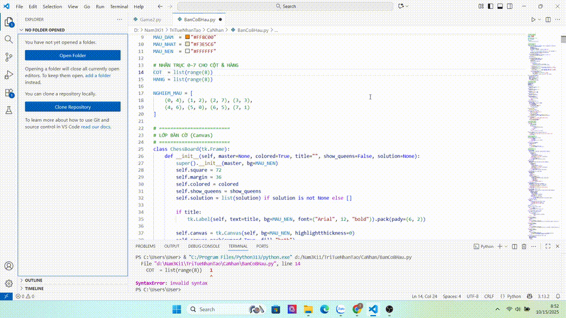
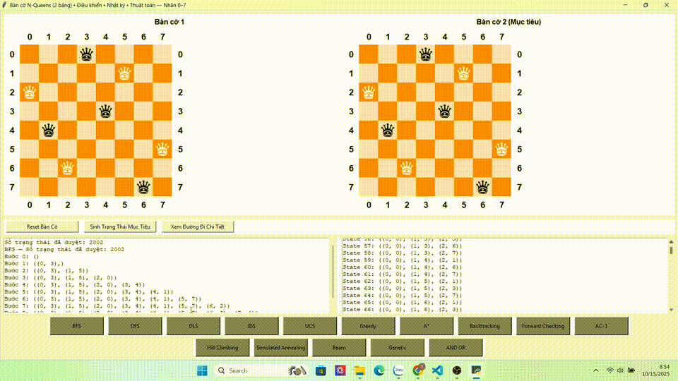
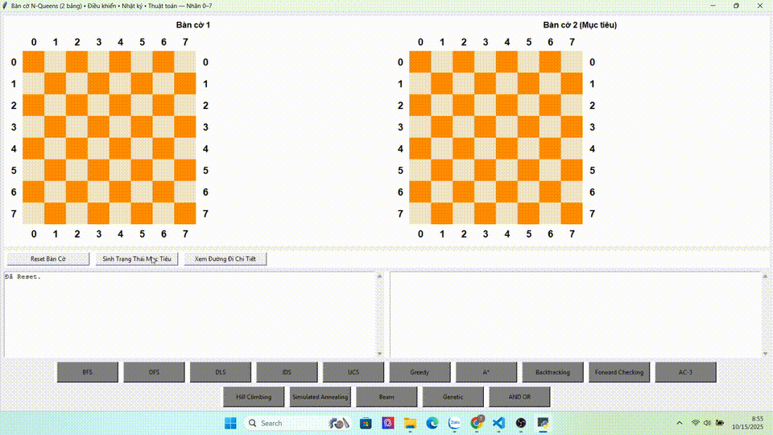

# 🎓 BÀI TẬP CÁ NHÂN MÔN TRÍ TUỆ NHÂN TẠO
## Bài toán 8 Quân Hậu - 15 Thuật toán AI

**Sinh viên thực hiện:** Trần Đức Trường
**MSSV:** 23110164 
**Lớp:** 251ARIN330585_04CLC
**Môn học:** Trí tuệ nhân tạo
**Giảng viên:** Phan Thị Huyền Trang

---

## 📋 THÔNG TIN BÀI TẬP

### Yêu cầu đề bài:
Triển khai bài toán 8 quân xe sử dụng 15 thuật toán AI khác nhau bao gồm:
- Tìm kiếm không có thông tin
- Tìm kiếm có thông tin  
- Thỏa mãn ràng buộc
- Tìm kiếm cục bộ
- Tìm kiếm tiến hóa
- Tìm kiếm đồ thị

### Mục tiêu bài toán:
Đặt 8 quân hậu trên bàn cờ 8×8 sao cho không có quân nào tấn công được quân nào khác. Hậu di chuyển theo hàng ngang, hàng dọc và cả đường chéo.

## 🎬 DEMO CHƯƠNG TRÌNH



*Minh họa tổng quan giao diện và menu chọn thuật toán*

---

## 🚀 HƯỚNG DẪN CHẠY CHƯƠNG TRÌNH

### Bước 1: Kiểm tra yêu cầu hệ thống
# Cần Python 3.8+ (bản cài chuẩn từ python.org có sẵn Tkinter trên Windows/macOS)
python --version

# (Tuỳ chọn) kiểm tra pip
pip --version


### Bước 2: Cài đặt thư viện cần thiết
# Ubuntu/Debian
sudo apt-get update && sudo apt-get install -y python3-tk

# Fedora
sudo dnf install -y python3-tkinter


### Bước 3: Tải và giải nén file nộp bài
- Giải nén file ZIP đã nộp
- Mở terminal/command prompt
- Di chuyển tới thư mục chứa code:
```bash
cd "đường_dẫn_tới_thư_mục/BanCo8Hau"  

```

---

## 🎮 CÁCH CHẠY CHƯƠNG TRÌNH

### Option 1: Chạy nhanh giao diện Tkinter (KHUYẾN NGHỊ)
python BanCo8Hau.py
# hoặc (tuỳ máy)
python3 BanCo8Hau.py

### Option 2: Menu đầy đủ các tùy chọn
- Mở cửa sổ có 2 bàn cờ (trái: diễn tiến, phải: mục tiêu).

- Nút “Sinh Trạng Thái Mục Tiêu” để tạo cấu hình 8 hậu hợp lệ ở bàn phải.

- Nút BFS/DFS/DLS/IDS/UCS/Greedy/A/Backtracking/Forward Checking/AC-3/Hill/SA/Beam/GA/AND-OR* để chạy thuật toán và xem hoạt ảnh.

- Nút “Xem Đường Đi Chi Tiết” để xem log duyệt trạng thái; “Reset Bàn Cờ” để làm mới.


## 📊 15 THUẬT TOÁN ĐÃ TRIỂN KHAI

### 🔍 TÌM KIẾM KHÔNG CÓ THÔNG TIN

| STT | Thuật toán | Mô tả | Demo |
|-----|------------|-------|------|
| 1 | **BFS** - Breadth-First Search | Tìm kiếm theo chiều rộng |  |
| 2 | **DFS** - Depth-First Search | Tìm kiếm theo chiều sâu |  |
| 3 | **UCS** - Uniform Cost Search | Tìm kiếm chi phí đồng nhất |  |
| 4 | **IDS** - Iterative Deepening Search | Tìm kiếm sâu dần |  |
| 5 | **DLS** - Iterative Deepening Limited | Tìm kiếm sâu dần có giới hạn |  |

### 🎯 TÌM KIẾM CÓ THÔNG TIN

| STT | Thuật toán | Mô tả | Demo |
|-----|------------|-------|------|
| 6 | **Greedy** - Greedy Best-First | Tham lam theo heuristic |  |
| 7 | **A*** - A-star Search | Tối ưu với heuristic |  |

### 🔒 THỎA MÃN RÀNG BUỘC (CSP)

| STT | Thuật toán | Mô tả | Demo |
|-----|------------|-------|------|
| 8 | **Backtracking** | Quay lui cơ bản |  |
| 9 | **Forward Checking** | Kiểm tra tiến |  |
| 10 | **AC-3** - Arc Consistency | Tính nhất quán cung |  |

### 🏔️ TÌM KIẾM CỤC BỘ

| STT | Thuật toán | Mô tả | Demo |
|-----|------------|-------|------|
| 11 | **Hill Climbing** | Leo đồi |  |
| 12 | **Simulated Annealing** | Luyện kim mô phỏng |  |
| 13 | **Beam Search** | Tìm kiếm chùm |  |

### 🧬 TÌM KIẾM TIẾN HÓA

| STT | Thuật toán | Mô tả | Demo |
|-----|------------|-------|------|
| 14 | **Genetic Algorithm** | Thuật toán di truyền |  |

### 🌳 TÌM KIẾM ĐỒ THỊ

| STT | Thuật toán | Mô tả | Demo |
|-----|------------|-------|------|
| 15 | **AND-OR Search** | Tìm kiếm đồ thị AND-OR |  |

---

## 🎯 CÁCH KIỂM TRA BÀI TẬP

### Test cơ bản:
1. Chạy 'python BanCo8Hau.py' - Kiểm tra giao diện có hoạt động
2. Bấm “Sinh Trạng Thái Mục Tiêu” → bàn phải có đủ 8 hậu (mục tiêu hợp lệ).
3. Bấm một thuật toán (ví dụ BFS) → xem hoạt ảnh trên bàn trái chạy đến nghiệm.
4. Bấm “Xem Đường Đi Chi Tiết” → log bên phải hiển thị dãy trạng thái.
5. Bấm “Reset Bàn Cờ” → hai bàn về rỗng, log xoá.

### Test chi tiết:
1. Thử từng thuật toán riêng lẻ trong menu
2. Kiểm tra thông tin nodes expanded và thời gian
3. Xem kết quả hiển thị có chính xác không
4. **Quan sát demo GIFs** - So sánh với kết quả thực tế

### Kết quả mong đợi:
- **Thành công**: Tìm được cấu hình 8 hậu sao cho không quân nào tấn công nhau (hàng, cột, chéo).
- **Nodes expanded**: Log hiển thị số trạng thái đã duyệt cho mỗi thuật toán.
- **Thời gian**: Có log tóm tắt (và trace chi tiết với các thuật toán cục bộ).
- **Visual**: Giao diện giống như trong demo GIFs

## 🎨 VISUAL SHOWCASE

Bài tập này có **16 demo GIFs** cho thấy:
- 🎬 **Demo tổng quan**: Giao diện chính và cách sử dụng
- 🧠 **15 thuật toán AI**: Mỗi thuật toán có demo riêng
- 🎯 **So sánh trực quan**: Thấy rõ sự khác biệt giữa các thuật toán
- 📊 **Performance metrics**: Nodes expanded, time, conflicts
- 🎮 **Interactive**: Click, keyboard shortcuts, menu system

---

## 📁 CẤU TRÚC FILE CODE

```
BanCo8hau/
├─ BanCo8Hau.py            # 🔰 File CHẠY CHÍNH (mở GUI Tkinter, 2 bàn cờ, nút thuật toán)
├─ ui.py                   # Giao diện: lớp ChessBoard, vẽ bàn cờ, log, nút bấm, điều khiển/khóa nút
├─ core.py                 # Lõi N-Queens: state, sinh trạng thái con, kiểm tra hợp lệ (hàng/cột/chéo)
├─ algorithms_state.py     # Nhóm tìm kiếm trên không gian trạng thái:
│                          #   BFS, DFS, DLS, IDS, UCS, Greedy, A*, AND-OR, phát đường đi, log
├─ algorithms_csp_local.py # Nhóm CSP & cục bộ:
│                          #   Backtracking (MRV+Degree+LCV), Forward Checking, AC-3,
│                          #   Hill Climbing, Simulated Annealing, Beam, Genetic
├─ app.py                  # (Tuỳ chọn) Điểm gom/hỗ trợ: mapping nút → hàm, hằng số, tiện ích chung
├─ README.md               # Báo cáo/README của đồ án
└─ images/                 # GIF/MP4 minh hoạ từng thuật toán (BFS.gif, DFS.gif, AStar.gif, ...)
   ├─ BFS.gif
   ├─ DFS.gif
   ├─ UCS.gif
   ├─ IDS.gif
   ├─ DLS.gif
   ├─ Greedy.gif
   ├─ AStar.gif
   ├─ Backtracking.gif
   ├─ ForwardChecking.gif
   ├─ AC3.gif
   ├─ HillClimbing.gif
   ├─ SimulatedAnnealing.gif
   ├─ BeamSearch.gif
   ├─ Genetic.gif
   └─ ANDOR.gif


## 📈 KẾT QUẢ MONG ĐỢI KHI CHẤM BÀI

### Điểm tối đa nếu:
- ✅ Chạy được tất cả 15 thuật toán
- ✅ Giao diện đẹp, dễ sử dụng
- ✅ Code có comment rõ ràng
- ✅ Kết quả chính xác
- ✅ Hiển thị thống kê chi tiết

### Các tính năng nổi bật:
- 🎨 Giao diện đồ họa trực quan
- 📊 Hiển thị thống kê chi tiết
- 🔍 Hiển thị vùng tấn công của quân hậu
- ⚡ 15 thuật toán AI đầy đủ
- 🚀 Nhiều cách chạy linh hoạt

---

## 📞 LIÊN HỆ HỖ TRỢ

Nếu gặp vấn đề khi chạy code, vui lòng liên hệ:
- **Email**: 23110164@student.hcmute.edu.vn
- **SĐT**: 0373868206

**Cảm ơn cô đã xem xét bài tập! **

